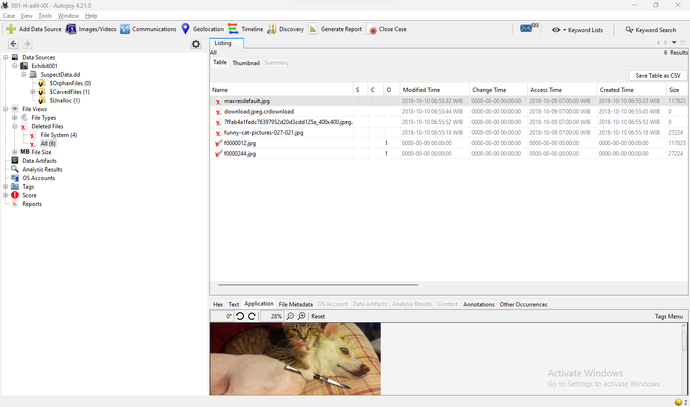

# Autopsy-Exercise---1203210145

1. Buat Case Number  

2. Buat struktur folder untuk autopsy didalam folder case number

3. Buat file txt untuk dokumentasi

4. Copy paste SuspectData ke folder Images/Exhibit001/

5. Buka Autopsy dan buat case baru

6. Set case name sesuai dengan case number dan set base directory ke "F:\Forensik\CASES\001-H-adit-XX\Autopsy"

7. Set case number dan data dari examiner serta organization

8. Set host name

9. Set data source type ke Disk Images

10. Select data source "SuspectData.dd" dan set timezone ke (GMT +0:00) UTC karena kita tidak tau tersangka ada di timezone berapa. Serta set hash value dari "SuspectData.dd"

11. Set Modules yang ingin digunakan untuk investigasi

12. Klik next dan Finish

13. Lihat-lihat filenya (Found a Secret Code!)

14. Lihat deleted files list

15. Lihat Images dengan gallery view

16. Lihat Hex suatu file dan buka pada HxD

17. Gunakan Keyword search, cari "key" dan "code"

18. Tag file hello sebagai notable dan SMBR sebagai bookmark

19. Buat file report

20. Cek Report

# Part 2 is still downloading "15Gb :((((("

1.	Add data source

2.	Specify new host name, lanjutan Exhibit001

3.	Set Source data type as Disk Image or VM File
4.	Set path to Image di Exhibit002 dan set timezone (GMT +0:00) UTC
5.	Configure Modules yang ingin digunakan untuk investigasi
6.	Adding data source (Started 8PM – Finished 8.30PM)
7.	Pada Vol3 NTFS terdapat file $MFT yang berarti vol3 merupakan C drive
8.	Pada Folder User terdapat NTUSER.DAT yang merupakan registry hive, tempat Dimana settings user disimpan
9.	Pada Installed Programs di Data Artifact menampilkan informasi aplikasi apa saja yang telah di install di sistem
10.	Pada Operation System Information terdapat info tentang OS yang digunakan pada kasus ini yang digunakan adalah Windows 10 Home yang berada di direktori “C:\Windows
11.	Pada Recent Documents menunjukan informasi file “baru” di akses dan darimana file tersebut di akses
12.	Pada Recycle Bin terdapat file yang berada pada recycle bin sistem dan file dapat direcover
13.	Bookmarking NMAP-setup dan NMAP pada Run Programs
14.	Bookmarking ConsoleHost-History.txt yang ada command menjalankan NMAP
15.	Shell Bags menunjukan folder yang diakses users/suspect
16.	USB Devices Attached menunjukan device apa saja yang tersambung ke sistem melalui USB
17.	Pada Web Accounts menunjukan login data
18.	Web Cache menunjukan informasi domain web dan kapan domain tersebut di akses
19.	Web Cookies hampir sama dengan Web cache dan juga menunjukan dari browser mana domain tersebut di akses
20.	Web Downloads menunjukan files yang didownload dan darimana file tersebut didownload serta kapan file tersebut didownload
21.	Bookmarking History download nmap setup
22.	Web Form Autofill Menunjukan yang mungkin adalah username dari user/suspect
23.	Web History Menunjukan informasi web history user (bisa locally)
24.	Web Search Menunjukan apa yang di typing oleh user dan pada browser apa
25.	EXIF Metadata berisi gambar jpg dan informasinya seperti date created, device model, device make, altitude, dll
26.	Extension Mismatch Detected berisi files yang extensi filenya tidak cocok dengan MIME typenya
27.	User Content Suspected berisi files yang Autopsy piker adalah file yang dibuat user
28.	Web Account Type Menunjukan tipe-tipe akun user
29.	Web Categories memisahkan informasi-informasi sesuai dengan domain dan hostnya
30.	Generate Report
31.	Hasil Report [The warning is because the ingestion took too long :<]

