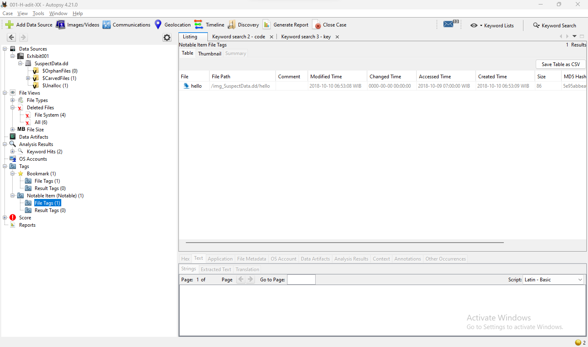

# Autopsy-Exercise---1203210145

1. Buat Case Number  

2. Buat struktur folder untuk autopsy didalam folder case number

3. Buat file txt untuk dokumentasi

4. Copy paste SuspectData ke folder Images/Exhibit001/

5. Buka Autopsy dan buat case baru

6. Set case name sesuai dengan case number dan set base directory ke "F:\Forensik\CASES\001-H-adit-XX\Autopsy"

7. Set case number dan data dari examiner serta organization

8. Set host name

9. Set data source type ke Disk Images

10. Select data source "SuspectData.dd" dan set timezone ke (GMT +0:00) UTC karena kita tidak tau tersangka ada di timezone berapa. Serta set hash value dari "SuspectData.dd"

11. Set Modules yang ingin digunakan untuk investigasi

12. Klik next dan Finish

13. Lihat-lihat filenya (Found a Secret Code!)

14. Lihat deleted files list

15. Lihat Images dengan gallery view

16. Lihat Hex suatu file dan buka pada HxD

17. Gunakan Keyword search, cari "key" dan "code"

18. Tag file hello sebagai notable dan SMBR sebagai bookmark

19. Buat file report

20. Cek Report

# Part 2 is still downloading "15Gb :((((("
